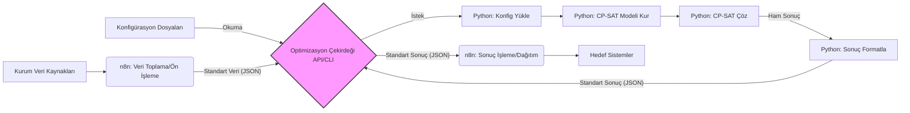

# Sistem Mimarisi

Bu belge, Kurumsal Optimizasyon ve Otomasyon Çözümü'nün önerilen sistem mimarisini detaylandırmaktadır.

## Genel Bakış

Proje, esneklik ve uyarlanabilirlik sağlamak amacıyla üç ana bileşenli modüler bir mimari üzerine kurulmuştur:

1.  **n8n (Veri Katmanı ve Otomasyon):** Veri toplama, ön işleme, optimizasyon çekirdeğini tetikleme ve sonuçların işlenip dağıtılmasından sorumludur.
2.  **Optimizasyon Çekirdeği (Python Servisi/Uygulaması):** CP-SAT kullanarak asıl optimizasyon problemini çözer. n8n ile standart bir arayüz (API veya CLI) üzerinden iletişim kurar.
3.  **Konfigürasyon Yönetimi:** Kuruma özel parametreleri ve ayarları yönetir.

## Bileşen Detayları

### 1. n8n İş Akışları

*   **Veri Toplama Akışı:**
    *   Kuruma özel veri kaynaklarına (Veritabanları, API'ler, CSV/Excel dosyaları) bağlanır.
    *   Gerekli verileri çeker (örn. personel listesi, görevler, vardiyalar, mevcut çizelgeler).
    *   Veriyi temizler, doğrular ve Optimizasyon Çekirdeği'nin beklediği standart JSON formatına dönüştürür.
    *   Kuruma özel konfigürasyon parametrelerini (eğer API ile gönderilecekse) veri yüküne ekler.
    *   Optimizasyon Çekirdeği'ni tetikler (API isteği veya komut çalıştırma).
*   **Sonuç İşleme Akışı:**
    *   Optimizasyon Çekirdeği'nden gelen standart JSON formatındaki sonuçları alır.
    *   Sonuçları kuruma özel formatlara (örn. raporlar, dashboard verisi) dönüştürür.
    *   Sonuçları ilgili sistemlere (Veritabanı, API, E-posta, Slack vb.) gönderir.
    *   Gerekirse onay veya bildirim adımlarını içerir.

### 2. Optimizasyon Çekirdeği (Python)

*   **Arayüz (API veya CLI):**
    *   **API (Önerilen - Flask/FastAPI):** n8n'in `HTTP Request` nodu ile kolayca iletişim kurmasını sağlayan bir RESTful API. Gelen istekte standart veri ve konfigürasyonu (veya konfig dosyası referansını) alır. Asenkron işlemler için (uzun süren optimizasyonlar) uygun olabilir.
    *   **CLI (Alternatif):** n8n'in `Execute Command` nodu ile çalıştırılabilen bir komut satırı arayüzü. Veri ve konfigürasyonu dosya veya komut argümanları olarak alır.
*   **Konfigürasyon Yöneticisi:**
    *   API isteğinden gelen veya belirtilen dosyadan (örn. `hastane_A_config.json`) kuruma özel konfigürasyonları okur.
*   **Model Oluşturucu:**
    *   Gelen veri ve konfigürasyona göre dinamik olarak CP-SAT modelini Python'da oluşturur.
    *   Konfigürasyondaki parametrelere göre (örn. `min_staffing`) ilgili kısıtları (`Add`) modele ekler.
    *   Hedef fonksiyonunu (`Minimize` veya `Maximize`) tanımlar.
*   **CP-SAT Çözücü Entegrasyonu:**
    *   `cp_model.CpSolver()` kullanarak modeli çözer.
    *   Çözüm süresi sınırı gibi çözücü parametrelerini konfigürasyondan alır.
*   **Sonuç Formatlayıcı:**
    *   Çözücüden gelen sonucu (Optimal, Feasible, Infeasible vb.) ve bulunan çözümü (örn. atama kararları) yakalar.
    *   Sonuçları n8n'in kolayca işleyebileceği standart bir JSON formatına dönüştürür.

### 3. Konfigürasyon Yönetimi

*   Her kurum veya problem tipi için ayrı konfigürasyon dosyaları (JSON veya YAML önerilir).
*   Bu dosyalar şunları içerir:
    *   Kuruma özel tanımlayıcı bilgiler.
    *   Optimizasyon parametreleri (örn. çözücü süresi, hedef fonksiyon ağırlıkları).
    *   Modele eklenecek dinamik kısıtların değerleri (örn. minimum personel sayıları, yetenek gereksinimleri).
    *   (İsteğe bağlı) Veri kaynağı bağlantı bilgileri (n8n tarafında da yönetilebilir).

## Kapsam Notu: Departmanların Modellenmesi

Bu projenin ilk fazında, **departmanlar** (örn. Kardiyoloji, Acil Servis, Üretim Hattı B) sistemde **ayrı bir varlık olarak açıkça modellenmeyecektir**. Bunun yerine, departman veya alan bazlı gereksinimler ve kısıtlamalar aşağıdaki yöntemlerle dolaylı olarak ele alınacaktır:

1.  **Özelleştirilmiş Vardiya Tanımları:** Vardiyalar (`shifts.csv` ve konfigürasyon) belirli bir departmanı veya alanı temsil edecek şekilde adlandırılabilir (örn. `Acil_Gunduz`, `YogunBakim_Gece`).
2.  **Konfigürasyon Bazlı Gereksinimler:** Her bir özelleştirilmiş vardiya için gerekli minimum personel sayısı, rol ve **spesifik yetenekler** (`skills.csv` ve `.yaml` konfigürasyonu) aracılığıyla tanımlanacaktır.

**Bu Yaklaşımın Nedenleri:**

*   **Başlangıç Karmaşıklığını Azaltma:** Departmanları ayrı bir varlık olarak eklemek; veri modelini, yapay veri üretimini, konfigürasyon yapısını ve optimizasyon mantığını ekstradan karmaşıklaştıracaktır. Projenin ilk aşamalarında çekirdek optimizasyon ve otomasyon akışına odaklanmak hedeflenmektedir.
*   **Esneklik:** Rol/yetenek bazlı yaklaşım, birçok departman benzeri ihtiyacı karşılamak için yeterli esnekliği sunmaktadır.

**Gelecek Değerlendirmesi:**
Eğer test aşamasında veya gerçek kurum entegrasyonlarında, departmanları açıkça modellemenin (personel aidiyeti, departmanlar arası geçiş kısıtları, doğrudan departman bazlı raporlama için) kesinlikle gerekli olduğu ortaya çıkarsa, bu özellik **gelecek bir geliştirme fazı** olarak eklenebilir. Mevcut modüler mimari bu tür bir genişlemeye izin vermektedir.

## Veri Akış Şeması

Bu mimari, bileşenlerin bağımsız olarak geliştirilmesini, test edilmesini ve farklı kurumsal ihtiyaçlara göre kolayca uyarlanmasını sağlar. 
