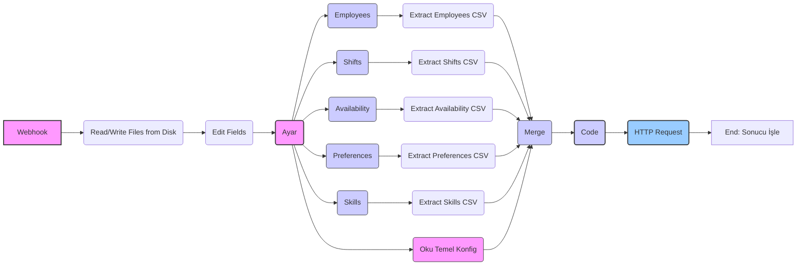

# n8n İş Akışı Tasarımı: Veri Hazırlama ve Optimizasyon Tetikleme

Bu belge, farklı veri kaynaklarından (CSV dosyaları) veri okuyup işleyerek standart JSON formatına dönüştüren ve Python Optimizasyon Çekirdeği API'sini tetikleyen n8n iş akışının tasarımını açıklar.

**Ana Hedefler:**

*   Farklı veri dosyalarını (CSV) okumak.
*   Verileri birleştirmek ve `docs/data_model.md`'de tanımlanan `OptimizationRequest` JSON formatına dönüştürmek.
*   Kuruma özel konfigürasyonu dahil etmek.
*   Webhook parametreleriyle dinamik yapılandırma sağlamak.
*   Python Optimizasyon Çekirdeği API'sine isteği göndermek.
*   Farklı kurum senaryolarına uyarlanabilir olmak.

## Gerçekleştirilen İş Akışı Yapısı

İş akışı, aşağıdaki temel bileşenlerden oluşur:

1. **Webhook:**
   * **Node:** `Webhook`
   * **Amaç:** İş akışını HTTP isteği ile tetiklemek ve dinamik parametreleri almak.
   * **Yapılandırma:**
     * HTTP Method: POST
     * Path: optimization
     * Response Mode: Last Node
   * **Parametreler:** `veriSeti`, `objective_weights`, `solver_params`

2. **Read/Write Files from Disk:**
   * **Node:** `Read/Write Files from Disk`
   * **Amaç:** Sistemdeki aktif ayarlar dosyasını okumak.
   * **Yapılandırma:**
     * File Selector: /mnt/workflow_configs/aktif_ayarlar.json
     * Options: fileName: aktifAyarlar
     * Always Output Data: true

3. **Edit Fields:**
   * **Node:** `Set`
   * **Amaç:** Webhook parametrelerine göre temel ayarları belirlemek.
   * **Yapılandırma:**
     * Mode: Raw
     * JSON Output: Webhook'tan gelen `veriSeti` parametresine göre dosya yollarını belirler.

4. **Ayar:**
   * **Node:** `Code` (JavaScript)
   * **Amaç:** Webhook parametreleri ve aktif ayarları kullanarak dosya yollarını belirlemek.
   * **Girdi:** Edit Fields düğümünden gelen ayarlar ve aktif_ayarlar.json dosyası.
   * **Mantık:** Veri seti ve kural seti bilgilerine göre dosya yollarını oluşturur.
   * **Output:** Dosya yolları ve konfigürasyon bilgileri.

5. **Oku Temel Konfig:**
   * **Node:** `Read/Write Files from Disk`
   * **Amaç:** Belirlenen veri setine ait YAML konfigürasyon dosyasını okumak.
   * **Yapılandırma:**
     * File Selector: `={{ $node["Ayar"].json.configPath }}`
     * Options: fileName: baseConfigYamlContent

6. **Dosya Okuma Düğümleri:**
   * **Nodes:** `Employees`, `Shifts`, `Availability`, `Preferences`, `Skills`
   * **Amaç:** Belirlenen veri setine ait CSV dosyalarını okumak.
   * **Yapılandırma:** Her düğüm, Ayar düğümünden gelen ilgili dosya yolunu kullanır.

7. **CSV Çıkarma Düğümleri:**
   * **Nodes:** `Extract Employees CSV`, `Extract Shifts CSV`, `Extract Availability CSV`, `Extract Preferences CSV`, `Extract Skills CSV`
   * **Amaç:** Okunan CSV verilerini JSON formatına dönüştürmek.
   * **Yapılandırma:**
     * Binary Property Name: İlgili dosya verisi (employeesData, shiftData, vb.)
     * Options: headerRow: true

8. **Merge:**
   * **Node:** `Merge`
   * **Amaç:** Tüm CSV verilerini tek bir veri akışında birleştirmek.
   * **Yapılandırma:**
     * Number Inputs: 5
     * Mode: Merge By Position (3.1 sürümü)

9. **Code:**
   * **Node:** `Code` (JavaScript)
   * **Amaç:** Verileri işleyip API'ye gönderilecek formata dönüştürmek.
   * **Girdi:** Merge düğümünden gelen veriler ve Oku Temel Konfig düğümünden gelen YAML içeriği.
   * **Mantık:**
     * YAML konfigürasyonunu parse eder.
     * Webhook'tan gelen parametrelerle konfigürasyonu günceller.
     * Verileri kategorilere ayırır (employees, shifts, skills, availability, preferences).
     * Departman bilgilerini kontrol eder ve departman istatistiklerini oluşturur.
     * Vardiyası olan ancak çalışanı olmayan departmanları tespit eder.
     * API'ye gönderilecek JSON formatını oluşturur.
     * Konfigürasyon dosyası referansını dinamik olarak ekler.
   * **Output:** API isteği için hazırlanmış JSON nesnesi.

10. **HTTP Request:**
    * **Node:** `HTTP Request`
    * **Amaç:** Hazırlanan verileri Optimizasyon API'sine göndermek.
    * **Yapılandırma:**
      * Method: POST
      * URL: http://host.docker.internal:8000/optimize veya üretim ortamında belirtilen URL
      * Send Headers: true
      * Header Parameters: Content-Type: application/json
      * Send Body: true
      * Specify Body: json
      * JSON Body: `={{ $json }}`

## Esneklik ve Uyarlanabilirlik Notları

* **Webhook Parametreleri:** İş akışı, webhook parametreleri aracılığıyla dinamik olarak yapılandırılabilir. `veriSeti`, `objective_weights` ve `solver_params` parametreleri ile farklı senaryolar için aynı iş akışı kullanılabilir.

* **Aktif Ayarlar:** `/mnt/workflow_configs/aktif_ayarlar.json` dosyası, varsayılan veri seti ve kural seti bilgilerini içerir. Bu dosya güncellenerek, webhook parametresi belirtilmediğinde kullanılacak varsayılan değerler değiştirilebilir.

* **Dinamik Dosya Yolları:** Ayar düğümü, veri setine göre dosya yollarını dinamik olarak oluşturur. Yeni bir veri seti eklemek için sadece bu düğümdeki JavaScript kodunu güncellemek yeterlidir.

* **Konfigürasyon Güncelleme:** Code düğümü, temel YAML konfigürasyonunu webhook parametreleriyle dinamik olarak günceller. Bu sayede, her istek için farklı optimizasyon parametreleri kullanılabilir.

* **Veri Sınıflandırma:** Code düğümü, verileri özelliklerine göre otomatik olarak sınıflandırır. Bu sayede, farklı formatlardaki veriler bile doğru şekilde işlenebilir.

* **Departman Kontrolü:** Code düğümü, departman bilgilerini kontrol eder ve vardiyası olan ancak çalışanı olmayan departmanları tespit eder. Bu sayede, optimizasyon öncesinde veri tutarlılığı sağlanır.

* **Docker Entegrasyonu:** İş akışı, Docker konteynerları içinde çalışacak şekilde tasarlanmıştır. `host.docker.internal` kullanılarak, aynı Docker ağındaki diğer servislere erişim sağlanır.

* **Hata Yönetimi:** İş akışı, eksik veya hatalı veriler için kontroller içerir ve uygun hata mesajları üretir.

Bu iş akışı, hem mevcut veri setleriyle çalışacak hem de gelecekte farklı veri kaynaklarına ve kurallara uyum sağlayabilecek esnek bir yapı sunmaktadır. Webhook parametreleri ve aktif ayarlar dosyası sayesinde, kod değişikliği yapmadan farklı senaryolar için kullanılabilir.